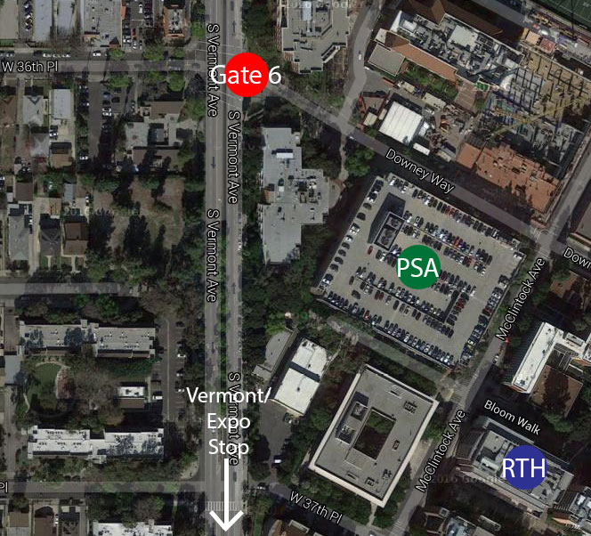

# 16th SoCal PLS:   Programming Languages and Systems

The SoCal Programming Languages and Systems Workshop is an informal gathering of
programming languages and systems researchers in Southern California.

This spring, we'll meet at the [University of Southern California][usc] on
**Saturday, April 30th, 2016**.

---

## Workshop in Spring 2016

The primary goals of this workshop include:

* Providing a friendly environment for students and other researchers to present
  their work.
* Strengthening ties between local institutions.
* Learning about cool happenings in programming languages, systems, and related
  areas!

---

## Schedule and Local Information

The workshop will be in Ronald Tutor Hall (RTH), room 526. This is on the Western side of campus -- don't get confused by the similarly named Ronald Tutor Campus Center. Be advised that only the doors on the North side of RTH will be unlocked. Once inside, take the elevator to the 5th floor, and 526 is immediately to the left.

### Driving Directions and Parking
If you are driving to USC, be advised that due to a March of Dimes event near campus, there will be several street closures near USC. In particular, you should avoid Jefferson, Figueroa, Hoover, and Exposition. Instead, you should approach campus from Vermont. Take the 10 freeway, exit Vermont, and head south until you reach Gate 6, which is at Vermont and 36th Pl.

If you requested parking, give your name to the parking attendant at Gate 6, and they will give you a parking pass to park in Parking Structure A (PSA). If you requested 2+ passes for your group, the first 2+ names will be on the parking list (if you're unsure which names to use, feel free to contact me).

### Public Transportation
If you prefer public transportation, you can take the [Expo Line](https://www.metro.net/projects/exposition/) to the Vermont/Exposition stop. This is a very short walk to RTH.

### Map

### Schedule

|----------|--------------------------------------------------------|
| 9:30AM   | Breakfast                                              |
| 10:00AM  | Declarative Fence Insertion *John Bender, UCLA*     |
| 10:30AM  | The Importance of Efficient Fine-Grain Synchronization for Many-Core Systems *Tongsheng Geng, UCI and Alfredo Goldman, USP* |
| 11:00AM  | Break                                                  |
| 11:15AM  | Building a Better Undergraduate Compiler Course *Sanjay Madhav, USC* |
| 11:45AM  | Lunch                                                  |
| 12:45PM  | Breaking Through the Normalization Barrier: A Self-Interpreter for F-omega *Matt Brown, UCLA* |
| 1:15PM   | Space-Efficient Latent Contracts *Michael Greenberg, Pomona College* |
| 1:45PM   | Break                                                  |
| 2:00PM   | Fixing the Java Memory Model with Volatile-by-Default Semantics *Lun Liu, UCLA* |
| 2:30PM   | A First-Principles Approach to Computer Networking *Joe Touch, USC/ISI* |
| 3:00PM   | Coffee Break                                           |
| 3:15PM   | Business Meeting/Discussion                            |

---

## Important Dates

|-----------------------|-------------------------------------------|
| Saturday, April 9th   | Abstract submission deadline (end of day) |
| Wednesday, April 13th | Notification of acceptance                |
| Wednesday, April 20th | Registration deadline                     |
| Saturday, April 30th  | SoCal PLS Workshop                        |

---

## Submission Guidelines

Both original research and work that has been published in other venues is
welcome!

Authors should submit abstracts of at most ~300 words via ([this](https://docs.google.com/forms/d/1SfidMAP8eHP8V1gFlninJflKH3Tvj2hNnpz0JB1ZxUY/viewform)) Google
form. The submission deadline is **Saturday, April 9th**, by the end of the day.

Selected abstracts will be presented as a talk or a poster. The program
committee will determine the length of the talks based on the number and content
of the abstracts; and they'll provide more information when they notify you of
acceptance.

---

## Registration

There will be no registration fee. Please register via ([this form](http://goo.gl/forms/AptCpvr9yE)).

Please register by **Wednesday, April 20th**, so that we can get an accurate
headcount for ordering food and acquiring parking passes.

---

## Program Committee

|--------------------|---------|
|[Brian Demsky](http://plrg.eecs.uci.edu/)               | UCI     |
|[Pedro Diniz](http://www.isi.edu/~pedro/)               | USC/ISI |
|[Michael Greenberg](http://www.cs.pomona.edu/~michael/) | Pomona  |
|[Ben Hardekopf](http://www.cs.ucsb.edu/~benh/)          | UCSB    |
|[Todd Millstein](http://web.cs.ucla.edu/~todd/)         | UCLA    |

---

## Organization

* Mailing List: socal@lists.ucla.edu
  [(subscribe)](http://lists.ucla.edu/cgi-bin/mailman/listinfo/socal)
* Local Organizer:
  [Sanjay Madhav](http://itp.usc.edu/faculty-staff/sanjay-madhav/)


